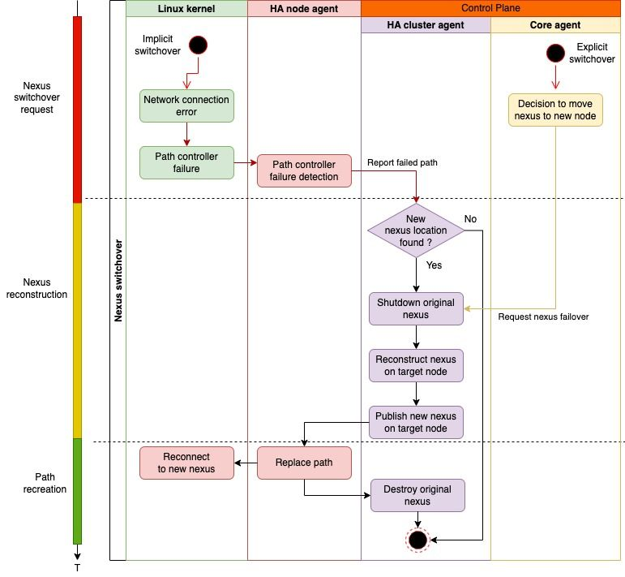
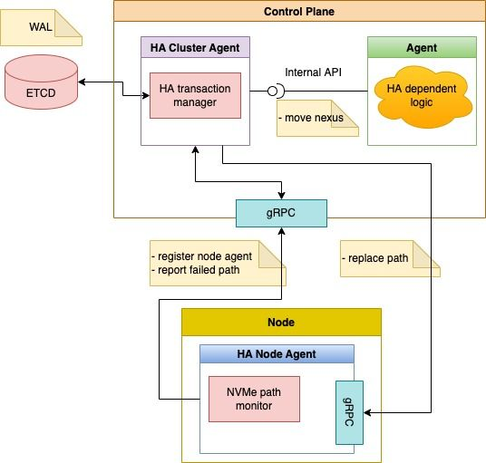
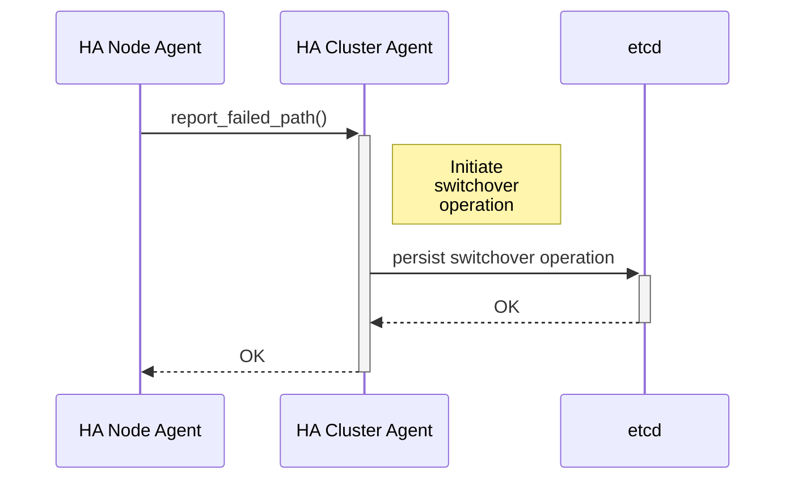
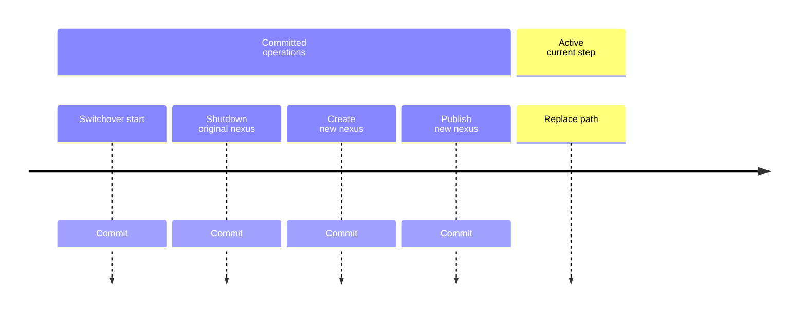

# Availability Design ("switchover")

## Target/Nexus failover

Nexus on-demand failover (or "switchover") is a process where we create replacement nexuses and reconnect applications to the newly created nexuses "on-demand". \
This is a different approach to an "active-active" high availability; the "on-demand" approach implicitly assumes some I/O downtime for clients while reconstructing and re-attaching a nexus, but dramatically simplifies synchronisation of a new nexus configuration.

Nexus switchover aims to provide I/O continuity for client applications tolerating the following types of errors:

- network: inability to send I/O requests from the application node to the nexus node
- node: the node itself may panic, restart, etc
- I/O engine (data-plane) pod crashes: inability to serve client I/O requests at the nexus level

Also, nexus switchover acts as a building block for the node drain logic, providing the ability for live migration of all active nexuses running on the node being drained.

## High Level Diagram

The following diagram depicts the process of nexus switchover and all involved components.

## Nexus Switchover Types

There are 2 types of nexus switchover:

- implicit nexus switchover
- explicit nexus switchover

### Implicit Nexus Switchover

- asynchronous (initiated in response to a path failure event, HA node agent doesn't rely on the switchover result)
- no new nexus location is known, HA cluster agent must determine optimal nexus placement

### Explicit Nexus Switchover

- synchronous (explicitly requested by a Dataplane component that awaits completion of the switchover)
- new nexus location is known

## Nexus Switchover Phases

The process of nexus switchover consists of the following main phases:

- nexus switchover request
- nexus reconstruction
- I/O path recreation

### Path Failure Detection

In order to initiate nexus switchover process, the failed NVMe path must be reliably detected at the application node and reported as failed.

Path failure detection is done by a dedicated component: HA node agent, which runs on every application node and constantly monitors the status of existing mayastor NVMe paths.

> see this page for details on NVMe path failure detection in Linux: [DETECTION]

### Nexus Reconstruction

#### Determining New Nexus Location

In case of implicit switchover, a new node needs to be selected to recreate the nexus:

- active topology policies for the nexus must be taken into account when selecting a new node
- inability to select a new node results in failed switchover operation

#### Nexus Shutdown

In order to prevent applications from seeing reservation errors while failing over healthy nexuses (for instance, upon node draining), there should be a way to suspend I/O on nexus before reconstructing/re-publishing the nexus on another node. To achieve this, a new "shutdown" operation shall be supported by I/O engine for nexuses, which shall do the following:

- pause the NVMe subsystem for nexus but keep nexus published
- abort all active replica rebuild operations
- complete all active nexus configuration changes (`etcd`)
- in case the nexus has been shutdown, it should not be re-created by the reconciler
- no new replicas can be added/removed to a shutdown nexus
- nexus remains in shutdown state until it's unpaused or deleted

> _**NOTE**_: there's currently no way of reversing a shutdown nexus

#### Nexus Recreation

The Nexus shall be recreated on target node with exactly the same NQN and same set of replica devices.

#### Nexus Re-Publishing

The Nexus shall be republished on target node with the same subsystem NQN as original nexus to be used by ANA subsystem on application's host.

### Path Recreation

Once the nexus is re-published, its URL can be used by the HA node agent to open a connection to the nexus and be transparently used by the NVMe ANA subsystem as a new path (since the NQN remains the same for re-created nexus). Upon path recreation, the NVMe paths transitions look as follows:

- The Original NVMe path, which is connected to the to the original nexus, fails: the application's I/O requests are paused whilst the path's controller performs a recovery loop. \
  _**Paths disposition**_: `(FAILED)`
- The HA node agent connects to the newly published nexus, and the second path is automatically recognised by NVMe ANA subsystem as a valid path second path to the nexus, which resumes application's I/O. \
  _**Paths disposition**_: `(FAILED, VALID)`
- The path to the first nexus is deleted by HA Node agent without affecting the second valid path. \
  _**Paths disposition**_: `(VALID)`

### Nexus I/O Fencing

In order to guarantee exclusive access to replicas and prohibit I/O from old nexus instance, NVMe reservation keys are used:

- the new nexus always reinstalls its own reservation keys on all replicas when opening them
- reservation errors (`SPDK_NVME_SC_RESERVATION_CONFLICT`) are handled differently when observed by nexus upon I/O requests to a replica device: such errors only remove replica from nexus I/O path and don't change the persisted nexus configuration in `etcd`

## HA Cluster Components

### Systems Diagram

The following diagram depicts HA systems components and relationships between them.

### High-Availability Cluster Agent

The HA Cluster agent is a component that manages nexus switchovers. \
It's part of the Control-Plane, but implemented as its own agent performing its specific task.

### Path Failure Reporting

The HA Cluster agent exposes `gRPC` methods for reporting a failed NVMe path by an HA Node agent

- reporting a failing path triggers an implicit switchover
- path failure reporting has "at least once" semantics: it's allowed for the same failed path to be reported more than once simultaneously - HA Cluster Agent shall not start a new switchover operation in case there is an active, existing switchover operation for the path
  > "at least once" allows for the implementation of stateless path failure detectors

### Persistence of Failover Operations

In order to survive crashes, the HA Cluster agent persistently stores active switchover operations in `etcd` in the form of a Write Ahead Log (WAL).

### Write-Ahead Log (`WAL`)

- every switchover operation has a corresponding `WAL` entry
- `WAL` entries are stored in `etcd`
- `WAL` entry consists of a sequence of steps, where a step must be marked as **COMMITTED** before starting a new step
- once the switchover operation is complete, `WAL` entry is removed
- every step shall support an 'undo' operation to revert changes made by the step
- once current step fails and is unable to proceed, all previous steps are undone and the whole switchover operation fails
- all non-complete `WAL` entries are replayed upon HA Cluster Agent start

> _NOTE_: as things stand today it's not possible to undo operations

## Switchover and Other Nexus-Related Operations

### Replica Rebuild

When switchover operation starts, all existing rebuild operations shall be stopped and restarted again once the nexus is successfully recreated.

New rebuild operations shall be rejected till nexus is successfully recreated.

Reconciler loop shall postpone replica reconciliation for nexuses being switched-over till the nexus is successfully recreated.

### Node Cordoning

- cordoned nodes are excluded from search when determining new nexus location for implicit switchover
- explicit switchover request shall fail when destination node for nexus is already cordoned
- cordoning a node doesn't affect active switchover operations for such a node

### Node Draining

- existing nexus switchover operations must complete before draining nexuses affected by switchover operations
