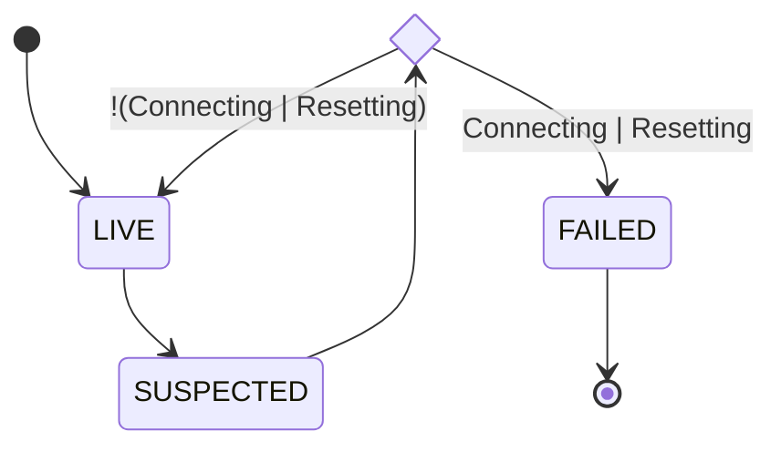

# HA Node Agent

## NVMe Path Failure Detection

- The HA node agent should be able to detect failure for NVMe path within a given detection interval `T`
- Exact failure detection time belongs to the interval: `[T/2, T]`

### Kernel Notification Mechanisms for NVMe Path State Changes

The Linux kernel uses [UDEV] events to notify user-space applications about a new device nodes created/removed in Linux device tree. The key thing to understand is that such events are emitted to notify only about generic, top-level actions that happen with target device at the device-tree level (like device being removed): every device may have its own internal states, and transition between those states, even if it critically impacts the behaviour of the device (like I/O timeout happening, which may cause the device to start queuing all I/O requests before connection restores), is not propagated via [UDEV] events.

#### Device Added

Such a [UDEV] event is emitted when NVMe host is connected to remote NVMe target and a new NVMe subsystem is created to represent the remote NQN:

```text
UDEV  [24900.119376] add      /devices/virtual/nvme-fabrics/ctl/nvme0 (nvme)
```

This event can be used to keep in sync locally cached NVMe subsystems to add a new entry to the cache.

### Device Removed

Such a [UDEV] event is emitted when NVMe host is disconnected from remote NVMe target, once the NVMe subsystem has been removed.

```text
UDEV  [24921.792726] remove   /devices/virtual/nvme-fabrics/ctl/nvme0 (nvme)
```

This event can be used to keep in sync locally cached NVMe subsystems to remove the subsystem from the cache.

### NVMe path failure: kernel view

Every path is represented inside the kernel as NVMe controller, with the following most important states:

| State            | Description                                                  |
|------------------|--------------------------------------------------------------|
| live             | The Controller is connected and I/O capable                  |
| connecting       | The Controller is disconnected, now connecting the transport |
| resetting        | The Controller is resetting (or scheduled reset)             |
| deleting         | The Controller is deleting                                   |
| deleting (no IO) | The Controller is deleting (with no IO)                      |

Once a path failure is encountered at the transport level (`TCP` socket in case of `NVMe-oF`), a controller reset is started and the NVMe controller transitions into the "resetting" state.
In this state, the controller only resets its core structures (like tearing-down I/O queues and stopping keep-alive timer), but doesn't reconnect I/O queues.

Once the controller is reset, it transitions into "connecting" state and starts I/O queues reconnection. It remains in the "connecting" state until all the queues have been reconnected.

```log
[298484.839124] nvme nvme0: starting error recovery
[298484.839533] nvme nvme0: Reconnecting in 10 seconds...
[298484.911991] block nvme0n1: no usable path - requeuing I/O
[298484.911999] block nvme0n1: no usable path - requeuing I/O
[298484.912001] block nvme0n1: no usable path - requeuing I/O
[298484.912003] block nvme0n1: no usable path - requeuing I/O
[298484.959851] br-9c4526f4944e: port 3(vethba2b6ea) entered disabled state
[298484.960950] vethae28d2c: renamed from eth0
[298484.976183] br-9c4526f4944e: port 3(vethba2b6ea) entered disabled state
[298484.978514] device vethba2b6ea left promiscuous mode
[298484.978529] br-9c4526f4944e: port 3(vethba2b6ea) entered disabled state
[298498.388392] nvme nvme0: failed to connect socket: -110
[298498.388587] nvme nvme0: Failed reconnect attempt 1
[298498.388589] nvme nvme0: Reconnecting in 10 seconds...
[298511.701018] nvme nvme0: failed to connect socket: -110
[298511.701224] nvme nvme0: Failed reconnect attempt 2
[298511.701227] nvme nvme0: Reconnecting in 10 seconds...
[298525.011952] nvme nvme0: failed to connect socket: -110
[298525.012139] nvme nvme0: Failed reconnect attempt 3
```

Once all I/O queues have been successfully reconnected, the controller transitions into the "live" state.

### On-Demand NVMe Path Failure Detection

Since the kernel does not record timestamps for NVMe path state changes, it is not possible to determine how long NVMe path has been in the `CONNECTING/RESETTING` state. In order to reliably classify a path as failed, a 2 step check needs to be performed against the NVMe path, with `T/2` frequency.



The HA node agent constantly monitors all suitable NVMe paths at `T/2` frequency to classify them as failed.

#### Obtaining NVMe Path Information

In order to get current state of a NVMe path, HA agent should access device nodes under /sys directory directly.

```sh
$> cat /sys/class/nvme/nvme0/state
connecting
```

### NVMe controller cache

The HA node agent should monitor only Mayastor NVMe targets, bypassing all other non-Mayastor NVMe targets. To simplify enumeration/filtering Mayastor NVMe targets, a local cache for NVMe controllers can be implemented.

1. This cache utilises [UDEV] events in order to keep all the records in sync with real-time device layout.
2. Only NVMe controllers with Mayastor NQNs ("subsysnqn") are recognised as valid cache entries.
3. NVMe path failure should check only cached NVMe controllers.

[UDEV]: https://en.wikipedia.org/wiki/Udev
