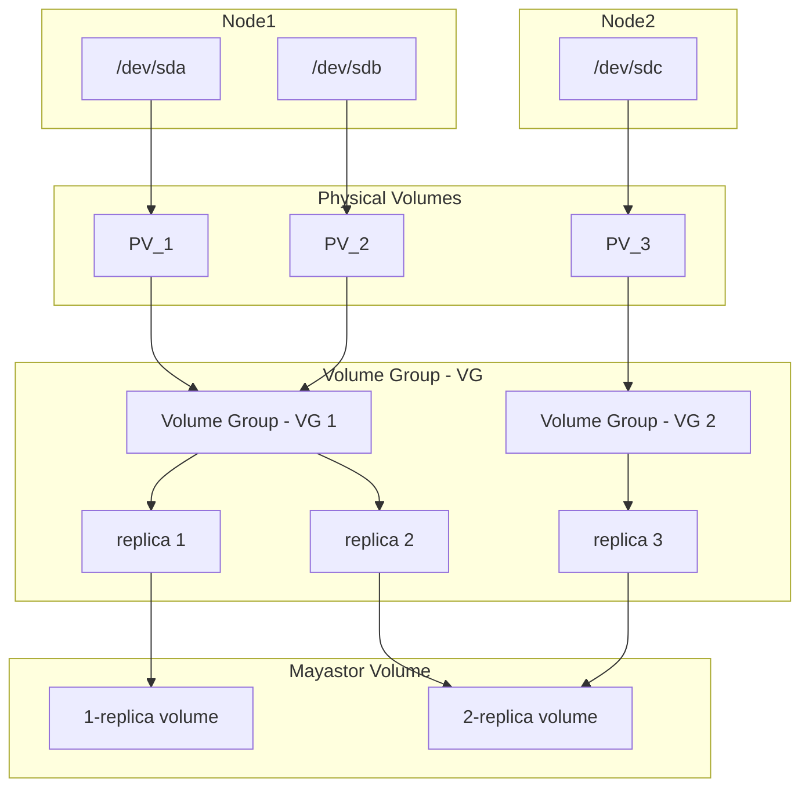

# LVM as an alternative backend to Mayastor (Experimental!)

Mayastor, a cloud-native declarative data plane written in Rust, aims to abstract storage resources
and their differences through the data plane.

In this document, we’ll explore how to integrate Logical Volume Management (LVM) as an alternative
backend for Mayastor pools.
LVM, a mature and widely adopted storage management system in Linux environments, offers robustness
and extensive features that can enhance Mayastor’s storage services.

## Motivation

LVM is a mature and widely adopted storage management system in Linux environments.
While the SPDK Blobstore (LVS) has been a reliable option, integrating LVM as an alternative backend
can captivate a broader audience due to its robustness and maturity, feature set,
and community support make it an attractive choice for Mayastor users.
By integrating LVM, we can also allow users to upgrade existing non-replicated LVM volumes
(eg: lvm-localpv) seamlessly.

## Goals

Alternative Backend: Enable Mayastor to use LVM volume groups as an alternative backend for storage
pools.
Dynamic Volume Management: Leverage LVM’s volume management features (resizing, snapshots,
thin provisioning) within Mayastor.
Simplicity: Abstract LVM complexities from users while providing robust storage services.

### Supporting Changes
1. Pools

   Mayastor pools represent devices supplying persistent backing storage.
   Introduce a new pool type: LVM Pool.
   Users can create new Mayastor pools with the LVM backend type.

2. LVM Integration

   Extend Mayastor to integrate with LVM.
   Implement LVM-specific logic for pool and replica creation, replica resizing, and snapshot management.
   Ensure seamless interaction between Mayastor and LVM.

3. Replication (HA)

   Extend Mayastor’s replication mechanisms to work with LVM-backed logical units.
   In short, make LVM backed volumes highly available across nodes.

4. Volume Management

   Mayastor will expose LVM volume management features through its pool API.
   Users can resize volumes online.
   Snapshots are managed transparently.

Features
---

- [x] Pool Operations
  - [x] Create
  - [x] Destroy
  - [x] Import
  - [x] List
- [x] Replica Operations
  - [x] Create
  - [x] Destroy
  - [x] Share/Unshare
  - [x] Resize
  - [x] List
- [ ] Thin Provisioning
- [ ] Snapshots
- [ ] Clones
- [ ] RAIDx

### Limitation
- Thin provisioning and snapshot support is not yet integrated
- RAID is not yet integrated

## Conclusion

By integrating LVM with Mayastor, you can leverage the benefits of both technologies. LVM provides dynamic volume management,
while Mayastor abstracts storage complexities, allowing you to focus on your applications.
Happy storage provisioning! 🚀

